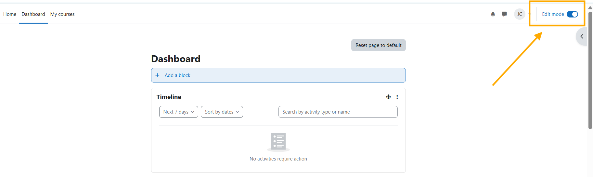
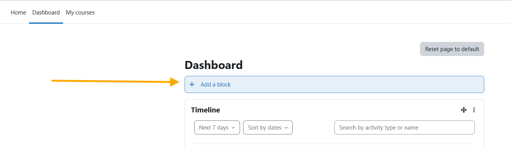
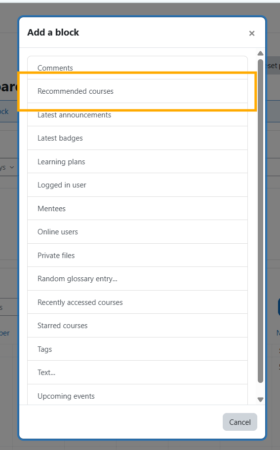

# Recommended Courses Block for Moodle

The **Recommended Courses Block** provides students with **personalized course recommendations** directly within their Moodle dashboard.  
By leveraging the **Ranking Activities AI** plugin and the **DataCurso AI Provider**, this block displays AI-generated suggestions based on each student’s learning preferences, satisfaction, and activity ratings.

With this block, learners can easily discover new courses that match their interests, while teachers and administrators benefit from increased visibility and engagement across the platform.

---

## Key Features

- **AI-Powered Course Recommendations** – Displays personalized course suggestions for each student based on activity ratings and engagement patterns.  
- **Dynamic Display Modes** – Choose between **card** or **list** view to browse recommended courses.  
- **Course Images** – Automatically retrieves or generates attractive thumbnails for every course.  
- **Pagination and Sorting** – Smooth navigation between multiple recommended courses.  
- **Visual and Responsive** – Designed with a modern, adaptive layout that fits Moodle’s dashboard perfectly.  
- **Powered by DataCurso AI** – Uses insights generated from the **Ranking Activities AI** plugin and analyzed by the **DataCurso AI Provider**.

---

## Pre-requisites

1. **Moodle 4.5 or higher**  
2. Install and configure the **Ranking Activities AI** plugin  
   → https://moodle.org/plugins/local_datacurso_ratings/versions  
3. The **DataCurso AI Provider** plugin must also be installed and licensed  
   → https://moodle.org/plugins/aiprovider_datacurso/versions

> **IMPORTANT:**  
> This block will not function unless both the **Ranking Activities AI** (`local_datacurso_ratings`) and the **DataCurso AI Provider** (`aiprovider_datacurso`) plugins are properly installed and configured.

---

## Installing via uploaded ZIP file

1. Log in to your Moodle site as an admin and go to  
   `Site administration > Plugins > Install plugins`.  
2. Upload the ZIP file containing the plugin code.  
3. Review the plugin validation report and finish the installation.

---

## Installing manually

You can also install this plugin manually by copying its contents into:

```
{your/moodle/dirroot}/blocks/datacurso_recomendate
```

Then log in to your Moodle site as an admin and go to  
`Site administration > Notifications` to complete the installation.

Alternatively, from the command line:

```bash
php admin/cli/upgrade.php
```

---

## Plugin Configuration

Once installed:

1. Log in as an administrator.  
2. Go to your **Dashboard** or any page that supports blocks.  
3. Click **“Add a block”** and select **Recommended Courses**.  
4. Ensure that the **Ranking Activities AI** and **DataCurso AI Provider** plugins are both active and licensed.  
5. The block will automatically display recommended courses for the logged-in user.  

---

## How It Works

- The block retrieves recommendations from the **Ranking Activities AI** plugin’s AI service.  
- Each course recommendation includes:
  - Course name and link  
  - Satisfaction and preference percentages  
  - Dynamic image (custom or automatically generated)  
- The user can switch between:
  - **Cards View** (visual layout with course thumbnails)  
  - **List View** (compact layout with quick course info)  
- A “Powered by DataCurso” label appears at the bottom of the block.

---

## How to add the block plugin to the Dashboard page

### 1. Activate edit mode
This will enable options for adding blocks to the page.



---

### 2. Click Add a Block
This will open a window where we will select the block.



---

### 3. Select the Recommended Courses Block
Select the block and it will load on your page.



---

### 4. View the Recommended Courses Block
This shows the recommended courses based on the student's activity likes information from the Ranking plugin. Puede ordenar la vista según lo que eliga en el selector. 


---
## License

2025 Data Curso LLC <https://datacurso.com>

This program is free software: you can redistribute it and/or modify it under  
the terms of the GNU General Public License as published by  
the Free Software Foundation, either version 3 of the License, or (at your option) any later version.

This program is distributed in the hope that it will be useful,  
but WITHOUT ANY WARRANTY; without even the implied warranty of  
MERCHANTABILITY or FITNESS FOR A PARTICULAR PURPOSE.  
See the GNU General Public License for more details.

You should have received a copy of the GNU General Public License  
along with this program.  
If not, see <https://www.gnu.org/licenses/>.
